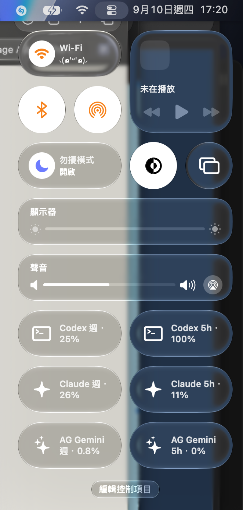

<a id="english"></a>

<div align="center">

# 📊 AI Usage

**Your Codex, Claude Code and Antigravity subscription usage, right in macOS Control Center.**

[](https://www.apple.com/macos/)
[](https://www.swift.org)
[](https://developer.apple.com/xcode/)
[](https://github.com/PeterPanSwift/AIUsage/releases/latest)
[](https://github.com/PeterPanSwift/AIUsage/releases)
[](#-install)

🇺🇸 **English** · [🇹🇼 繁體中文](#zh-tw)




</div>

## ✨ Features

- 🧭 **Control Center controls** for Codex, Claude and Antigravity. Each control shows the used percentage of a 5‑hour or weekly window in its title, so you can see it at a glance without opening anything.
- 🪟 **Menu bar app** with progress bars, reset times and stale/error states for every service.
- 🔄 **Auto refresh** every 5 minutes while the app runs. Clicking a control opens the app and refreshes immediately.
- 🔐 **Local only.** Usage is read from the CLIs you already logged into. Nothing is uploaded, and no tokens or conversations are stored.

## 📥 Install

1. Download `AIUsage-<version>.zip` from the [latest release](https://github.com/PeterPanSwift/AIUsage/releases/latest). The app is signed with a Developer ID and notarized by Apple.
2. Unzip and move **AIUsage.app** to `/Applications`, then launch it.
3. Make sure the CLIs are installed and logged in:
   - Codex: `codex login`
   - Claude Code: `claude` (log in once)
   - Antigravity: `/Applications/agy-usage/agy-usage login` (install [agy-usage](https://github.com/orrisroot/agy-usage) by orrisroot first)
4. Open Control Center, click **Edit Controls**, search for **AI Usage** and add the controls you want.
5. 💡 Resize each control to the wide pill size (drag the handle at its bottom-right corner). The small circle shows only an icon. The wide size shows the title with the percentage.
6. ⌨️ Press **fn + C** any time to open Control Center and check your AI usage in one keystroke.

## 🧩 Controls

| Service | Windows | Data source |
| --- | --- | --- |
| Codex | 5 hours · weekly | `codex app-server` JSON‑RPC `account/rateLimits/read` |
| Claude | 5 hours · weekly (all models) | `claude -p "/usage" --output-format json` |
| Antigravity Gemini | 5 hours · weekly | `agy-usage quota --json` |
| Antigravity Claude／GPT | 5 hours · weekly | `agy-usage quota --json` |

Antigravity data comes from [agy-usage](https://github.com/orrisroot/agy-usage), an open-source CLI by orrisroot. Missing quotas show `—` instead of 0%. Values older than 10 minutes or past their reset time are labelled as stale rather than assumed to be zero.

## 🛠 Build from source

Requirements: macOS 27, Xcode 27, an Apple Developer account (the App Group is derived from your team ID).

```bash
git clone https://github.com/PeterPanSwift/AIUsage.git
cd AIUsage
open AIUsage.xcodeproj
```

Set your own team under **Signing & Capabilities** for both targets and run the `AIUsage` scheme. Command‑line build and tests:

```bash
xcodebuild -project AIUsage.xcodeproj -scheme AIUsage -configuration Debug \
  -destination 'platform=macOS' -derivedDataPath build DEVELOPMENT_TEAM=YOUR_TEAM_ID build
swift test
swift run usage-probe
```

`Scripts/release.sh` archives, exports with Developer ID, notarizes, staples and publishes a GitHub release. Architecture notes and troubleshooting live in [DEVELOPMENT.md](DEVELOPMENT.md).

## ⚙️ How it works

- The main app runs outside the App Sandbox so it can launch the local CLIs with your login environment. It writes only percentages, window lengths and reset times to an App Group cache.
- The Control Center extension is sandboxed and only reads that cache. macOS decides when controls reload.
- Only CLI output is parsed. Emails, prompt credits and account details from the CLIs are never written to the cache.

---

<a id="zh-tw"></a>

<div align="center">

# 📊 AI Usage

**在 macOS 控制中心直接看到 Codex、Claude Code 與 Antigravity 的訂閱用量。**

[🇺🇸 English](#english) · 🇹🇼 **繁體中文**

</div>

## ✨ 功能

- 🧭 **控制中心控制項**：Codex、Claude、Antigravity 各有 5 小時與每週視窗，標題直接顯示已使用百分比，不用點開就看得到。
- 🪟 **選單列 App**：每個服務都有進度條、重置時間，以及舊資料／錯誤狀態。
- 🔄 **自動更新**：App 執行期間每 5 分鐘更新一次；點擊控制項會開啟 App 並立即更新。
- 🔐 **只在本機**：用量來自你已登入的 CLI，不上傳任何資料，也不儲存 token 或對話內容。

## 📥 安裝

1. 到 [最新版本](https://github.com/PeterPanSwift/AIUsage/releases/latest) 下載 `AIUsage-<版本>.zip`。App 已用 Developer ID 簽署並經 Apple 公證。
2. 解壓縮後把 **AIUsage.app** 移到「應用程式」，然後開啟。
3. 確認 CLI 已安裝並登入：
   - Codex：`codex login`
   - Claude Code：執行 `claude` 登入一次
   - Antigravity：`/Applications/agy-usage/agy-usage login`（請先安裝 orrisroot 的 [agy-usage](https://github.com/orrisroot/agy-usage)）
4. 打開控制中心，按「**編輯控制項目**」，搜尋 **AI Usage**，加入需要的控制項。
5. 💡 把每個控制項拖成寬的膠囊尺寸（拖右下角的把手）。小圓形只顯示圖示，寬尺寸才會顯示標題與百分比。
6. ⌨️ 之後隨時按 **fn + C** 就能一鍵打開控制中心查看 AI 用量。

## 🧩 控制項

| 服務 | 視窗 | 資料來源 |
| --- | --- | --- |
| Codex | 5 小時 · 每週 | `codex app-server` JSON‑RPC `account/rateLimits/read` |
| Claude | 5 小時 · 每週（所有模型） | `claude -p "/usage" --output-format json` |
| Antigravity Gemini | 5 小時 · 每週 | `agy-usage quota --json` |
| Antigravity Claude／GPT | 5 小時 · 每週 | `agy-usage quota --json` |

Antigravity 的資料來自 orrisroot 開源的 [agy-usage](https://github.com/orrisroot/agy-usage) CLI。沒有提供的額度顯示「—」而不是 0%。超過 10 分鐘或已到重置時間的數值會標記為舊資料，不會假設已歸零。

## 🛠 從原始碼建置

需求：macOS 27、Xcode 27、Apple 開發者帳號（App Group 由你的 Team ID 產生）。

```bash
git clone https://github.com/PeterPanSwift/AIUsage.git
cd AIUsage
open AIUsage.xcodeproj
```

在兩個 target 的 **Signing & Capabilities** 選擇自己的團隊，執行 `AIUsage` scheme。命令列建置與測試：

```bash
xcodebuild -project AIUsage.xcodeproj -scheme AIUsage -configuration Debug \
  -destination 'platform=macOS' -derivedDataPath build DEVELOPMENT_TEAM=YOUR_TEAM_ID build
swift test
swift run usage-probe
```

`Scripts/release.sh` 會封存、以 Developer ID 匯出、公證、加蓋並發佈 GitHub release。架構說明與疑難排解請見 [DEVELOPMENT.md](DEVELOPMENT.md)。

## ⚙️ 運作方式

- 主 App 不使用 App Sandbox，才能以你的登入環境執行本機 CLI；只把百分比、視窗長度與重置時間寫入 App Group 快取。
- 控制中心擴充功能在 Sandbox 內，只讀取該快取；由 macOS 決定控制項何時重新載入。
- 只解析 CLI 輸出；CLI 回傳的 email、prompt credits 與帳號資訊不會寫入快取。
